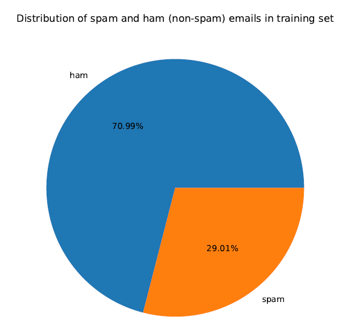
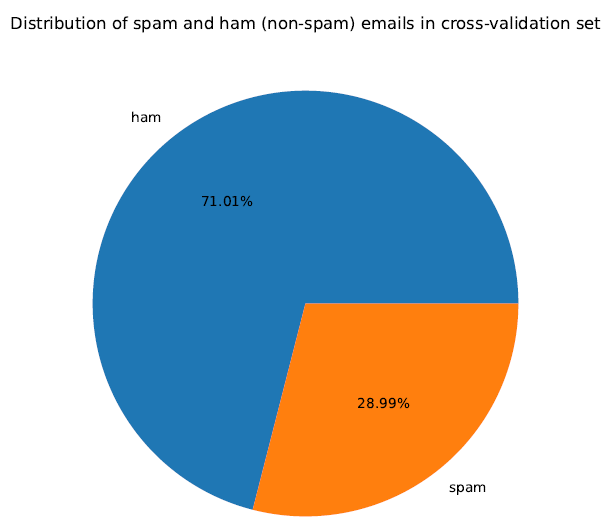

# SPAM-or-HAM
Spam emails (or simply, spams) are unwanted emails which the users are bombarded with. These emails can be of different types. For example, unwanted advertisements sent by marketing frms, suspicious emails sent by fraudsters to dupe unassuming users, emails containing links to malicious web pages that steal users' private information, etc. In this project, we try to build a simple spam filter leveraging SVM and Naive Bayes algorithm to detect spam and non-spam emails from the enron1 dataset.

## Enron dataset
We have used the **Enron Email Dataset** in this project. This dataset was collected and prepared by the CALO project and originally contains about 0.5M messages, collected from nearly 150 Enron employees. More deatails about the Enron dataset can be found [here](https://www.cs.cmu.edu/~./enron/).

### Training and Cross-validation split
In our project, we have randomly selected a subset containing only 5172 emails. We divide this subset in a ratio of 80:20 such that the training set contains 4137 emails and the cross-validation set contains 1035 emails. While creating the training and cross-validation set, we also ensure that these sets have nearly the same distribution of hams and spams. Specifically, there are 2937 hams and 1200 spams in the training set, leading to a distribution of 71:29 (approx). Similarly, the cross-validation set has 735 hams and 300 spams, leading to a distribution of 71:29 (approx). The following figures show the distribution of training and cross-validation sets.

**Training set distribution**

**Cross-validation set distribution**

## Instructions to reproduce code
Please follow the steps given below-

1. Copy 'enron1' (which contains training and test emails), 'test' (directory which contains all test mails) and all the python scripts to the same directory.
2. **TRAINING PHASE-** Run the scripts in the following order-
	(a) Run *collection_frequency.py*
	(b) Run *vocabulary_and_training_set_creation.py*
	(c) Run *cross_validation_set_creation.py*
	(d) Run *train_svm_classifier.py*
3. **TESTING PHASE-** Run *predict_emails.py* to predict emails in test set.

Link for downloading dataset- https://drive.google.com/file/d/1_G2175I1DAawnfGlIMdMAcgy3Sy5iwL2/view?usp=sharing

**Created by-**  
	*Debargha Bhattacharjee*  
	*CS19S028, MS Scholar*  
	*Department of Computer Science and Engineering*  
	*IIT Madras*  
	*CS5691 Pattern Recognition and Machine Learning Course Project*  
