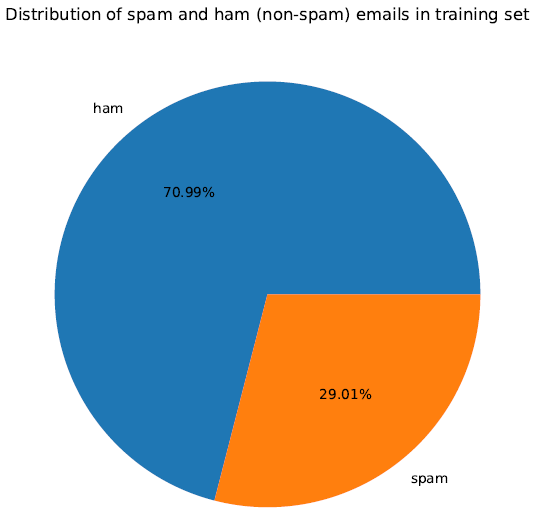

# SPAM-or-HAM
Spam emails (or simply, spams) are unwanted emails which the users are bombarded with. These emails can be of different types. For example, unwanted advertisements sent by marketing frms, suspicious emails sent by fraudsters to dupe unassuming users, emails containing links to malicious web pages that steal users' private information, etc. In this project, we try to build a simple spam filter leveraging SVM and Naive Bayes algorithm to detect spam and non-spam emails from the enron1 dataset.

## Enron Dataset
We have used the **Enron Email Dataset** in this project. This dataset was collected and prepared by the CALO project and originally contains about 0.5M messages, collected from nearly 150 Enron employees. More deatails about the Enron dataset can be found [here](https://www.cs.cmu.edu/~./enron/).

### Training and Cross-validation split
In our project, we have randomly selected a subset containing only 5172 emails. We divide this subset in a ratio of 80:20 such that the training set contains 4137 emails and the cross-validation set contains 1035 emails. While creating the *training* and *cross-validation* sets, we also ensure that these sets have nearly the same distribution of hams and spams. Specifically, there are 2937 hams and 1200 spams in the training set, leading to a distribution of 71:29 (approx), and the cross-validation set has 735 hams and 300 spams, leading to a distribution of 71:29 (approx).

    

        
        
    

## Feature Extraction
The spam and ham emails are present in the form of texts of varying lengths. The spam texts often contain misspelled words, target-specific words, etc., which can help distinguish them from non-spam email (ham) texts. Therefore, wordsbecome useful features. However, we need to convert these words (present in text format) to integers before using them as features.

### Text Preprocessing and Vocabulary
First, we preprocess the entire text to remove redundant words and characters from the text. The words that remain after the preprocessing will be used to create a vocabulary of unique words. These words by our classiffier model to classifiy the emails as hams and spams. The different text-preprocessing steps used for created the vocabulary are as follows:
- Removal of punctuation symbols
- Removal of numerical characters
- Removal of stopwords
- Lower-casing the words
- Removing words having length less than 2
- Word lemmatization

In addition to the above preprocessing steps, we also filter words whose frequency lie below a threshold frequency. This helps in filtering out the highly sporadic words which appear very rarely in the entire corpus and do not impart any important information that might help the classifier distinguish the spams from the hams. In fact, this *threshold frequency* is a hyperparameter that we tune on the cross-validation set during the classifier model training.

### Feature Matrix
After creating the vocabulary, we create the feature matrix for the emails in the training and cross-validation set. In this project, we use the **tf-idf scores** for creating the feature matrix. In other words, every email is repesented by a tf-idf vector composed of the tf-idf scores of the unique words in our vocabulary. We calculate the tf-idf score for each word as follows:

$$s_{w, e} = \log_{10}{(count(w, e) + 1} \times log_{10}{(\frac{N}{N_w})}$$

Here, $s_{w, e}$ is the tf-idf weighted value for word $w$ in document $e$, $count(w, e)$ is the raw count of the number of times word $w$ appears in email $e$, $N$ is the total number of emails in the collection, and $N_{w}$ is the number of emails in which word $w$ occurs.

The feature matrix for the training set is a $\mathcal{R}^{n_{t} \times d}$ matrix , where, $n_{t}$ is the number of emails in the training set, and $d$ is the number of words in the vocabulary. Similarly, the feature matrix for the cross-validation set is a \mathcal{R}^{n_{v} \times d} matrix , where, $n_{v}$ is the number of emails in the cross-validation set.

<!-- ## Classifier Models -->

## Instructions to reproduce code
Please follow the steps given below-

1. Copy 'enron1' (which contains training and test emails), 'test' (directory which contains all test mails) and all the python scripts to the same directory.
2. **TRAINING PHASE-** Run the scripts in the following order-
	(a) Run *collection_frequency.py*
	(b) Run *vocabulary_and_training_set_creation.py*
	(c) Run *cross_validation_set_creation.py*
	(d) Run *train_svm_classifier.py*
3. **TESTING PHASE-** Run *predict_emails.py* to predict emails in test set.

Link for downloading dataset- https://drive.google.com/file/d/1_G2175I1DAawnfGlIMdMAcgy3Sy5iwL2/view?usp=sharing

**Created by-**  
	*Debargha Bhattacharjee*  
	*CS19S028, MS Scholar*  
	*Department of Computer Science and Engineering*  
	*IIT Madras*  
	*CS5691 Pattern Recognition and Machine Learning Course Project*  